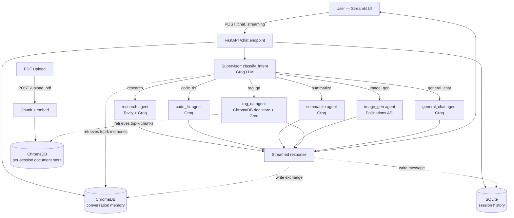
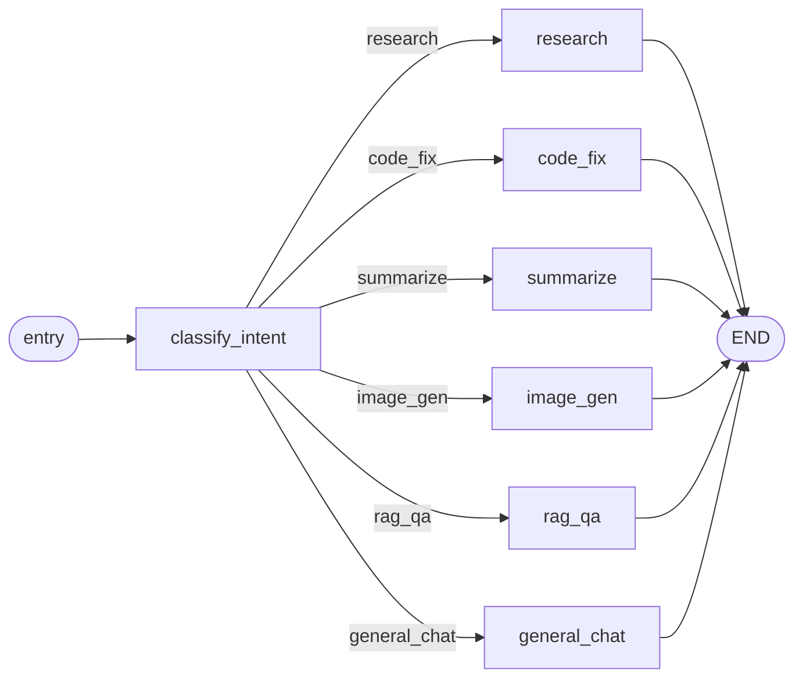

# Agentic Multi-Tool AI Assistant

[](https://www.python.org/)
[](https://fastapi.tiangolo.com/)
[](https://langchain-ai.github.io/langgraph/)
[](https://streamlit.io/)
[](LICENSE)

A multi-agent AI assistant with a **LangGraph** supervisor that classifies
every incoming message and routes it to one of six specialized agents —
web research, code debugging, summarization, image generation, PDF
question-answering (RAG), or general chat. Built with a **FastAPI**
streaming backend and a **Streamlit** chat frontend, with persistent
semantic memory via **ChromaDB** and full transcript history in **SQLite**.

Every LLM/tool call runs on a free tier: **Groq** for inference, **Tavily**
for web search, and **Pollinations** for keyless image generation — no
paid API keys required to run the full project.

Built by [**@sohaibbuilds**](https://github.com/sohaibbuilds).

---

## Preview

| | |
|---|---|
|  |  |
|  |  |

---

## Table of contents

- [Features](#features)
- [Architecture](#architecture)
- [Project structure](#project-structure)
- [Setup](#setup)
- [How routing works](#how-routing-works)
- [Example queries](#example-queries-per-agent)
- [Persistent memory](#persistent-memory)
- [Error handling and logging](#error-handling--logging)
- [Notes and limitations](#notes--limitations)
- [License](#license)

---

## Features

- 🧭 **LangGraph supervisor** — a single classifier node routes every
  message to the correct specialist agent in real time
- 🔎 **Research agent** — multi-step web research via Tavily search,
  synthesized and cited by Groq
- 🐛 **Code-fix agent** — detects the language, finds the bug, returns
  corrected code with a clear explanation
- 📝 **Summarize agent** — condenses text into an overview, key points,
  and a conclusion
- 🎨 **Image-gen agent** — generates original images from a text prompt via
  the Pollinations API
- 📄 **RAG Q&A agent** — upload a PDF, ask questions, get answers grounded
  in retrieved chunks
- 💬 **General chat agent** — fallback for everyday conversation
- 🧠 **Persistent memory** — ChromaDB stores embedded conversation history,
  retrieved as context for future turns
- 🗃️ **Full transcript history** — every message logged to SQLite,
  queryable per session
- ⚡ **Streaming responses** end-to-end, from the LLM through FastAPI's SSE
  to the Streamlit UI
- 🐳 **Docker Compose** included for one-command deployment

---

## Architecture



### LangGraph supervisor graph



See [`backend/supervisor.py`](backend/supervisor.py) for the actual
`StateGraph` definition — nodes, conditional edges, and the classifier
prompt.

---

## Project structure

```
agentic-multi-tool-ai-assistant/
├── backend/
│   ├── main.py                # FastAPI app: /chat (streaming), /upload_pdf, /history
│   ├── supervisor.py          # LangGraph StateGraph — classifier + routing
│   ├── llm.py                 # Shared Groq client wrapper (stream + non-stream)
│   ├── config.py              # Env-var driven settings
│   ├── logger.py              # Shared logging setup
│   ├── agents/
│   │   ├── research.py        # Tavily search + Groq synthesis
│   │   ├── code_fix.py        # Language detection + bug fixing
│   │   ├── summarize.py       # Overview / key points / conclusion
│   │   ├── image_gen.py       # Pollinations image URL generation
│   │   ├── rag_qa.py          # PDF chunk indexing + retrieval QA
│   │   └── general_chat.py    # Fallback conversational agent
│   ├── memory/
│   │   ├── chroma_memory.py   # Semantic conversation memory (ChromaDB)
│   │   └── sqlite_store.py    # Session/message transcript (SQLite)
│   ├── models/schemas.py      # Pydantic request/response models
│   └── requirements.txt
├── frontend/
│   ├── app.py                 # Streamlit chat UI, PDF upload, image rendering
│   └── requirements.txt
├── data/                      # SQLite DB + ChromaDB persistence (gitignored)
├── docker-compose.yml
├── backend/Dockerfile
├── frontend/Dockerfile
├── .env.example
└── README.md
```

---

## Setup

### 1. Get free API keys

| Service | Purpose | Link |
|---|---|---|
| Groq | LLM inference | https://console.groq.com/keys |
| Tavily | Web search | https://tavily.com (1,000 free searches/month) |
| Pollinations | Image generation | no key required |

### 2. Configure environment

```bash
cp .env.example .env
# then edit .env and paste in your GROQ_API_KEY and TAVILY_API_KEY
```

### 3a. Run with Docker (recommended)

```bash
docker compose up --build
```

- Backend: `http://localhost:8000` (interactive docs at `/docs`)
- Frontend: `http://localhost:8501`

### 3b. Run locally without Docker

```bash
# Backend
python -m venv .venv && source .venv/bin/activate
pip install -r backend/requirements.txt
uvicorn backend.main:app --reload --port 8000
```

```bash
# In a second terminal — frontend
pip install -r frontend/requirements.txt
BACKEND_URL=http://localhost:8000 streamlit run frontend/app.py
```

---

## How routing works

Every message sent to `POST /chat` first passes through
`supervisor.classify_intent`, which asks the Groq LLM to label it as
exactly one of: `research`, `code_fix`, `summarize`, `image_gen`, `rag_qa`,
or `general_chat`. The endpoint then streams back Server-Sent Events:

```
data: {"type": "intent", "intent": "research"}
data: {"type": "token", "content": "..."}
data: {"type": "token", "content": "..."}
data: {"type": "done"}
```

A specific agent can also be forced by passing `"intent_override": "code_fix"`
in the request body — useful for testing or custom UI shortcuts.

---

## Example queries per agent

| Agent | Example message |
|---|---|
| `research` | "What are the latest developments in small modular nuclear reactors, and which countries are leading deployment?" |
| `code_fix` | Paste a Python function with an off-by-one loop bug: "This is supposed to return the last 3 items but throws an IndexError, can you fix it?" |
| `summarize` | Paste a long article/report: "Summarize this for me." |
| `image_gen` | "Generate an image of a lighthouse at sunset in a watercolor painting style." |
| `rag_qa` | Upload a PDF via the sidebar, then: "According to the document, what were the Q3 revenue figures?" |
| `general_chat` | "What's a good way to structure a daily journaling habit?" |

---

## Persistent memory

- **ChromaDB — `conversation_memory` collection**: every user/assistant
  exchange is embedded (via Chroma's built-in `all-MiniLM-L6-v2` embedding
  function — no extra API key needed) and stored with `session_id` as
  metadata. Each new message retrieves the top-k most relevant past
  exchanges for that session as extra context.
- **ChromaDB — `rag_<session_id>` collections**: one collection per session
  holds the chunked, embedded text of any uploaded PDFs, used exclusively
  by the `rag_qa` agent.
- **SQLite — `data/sqlite/chat_history.db`**: the durable, ordered
  transcript of every message per session, queryable via
  `GET /history/{session_id}`.

---

## Error handling & logging

- All agent modules and the FastAPI layer share a structured logger
  (`backend/logger.py`).
- Missing API keys are detected at startup and logged as warnings rather
  than crashing, so unaffected agents keep working.
- The `/chat` stream emits an explicit `{"type": "error", "detail": "..."}`
  event on failure instead of silently dropping the connection; a global
  FastAPI exception handler returns structured JSON for non-streaming routes.
- PDF indexing validates that extractable text was found and returns a
  `422` with a clear message if a PDF appears to be scanned/image-only.

---

## Notes & limitations

- Pollinations, Groq, and Tavily free tiers are rate-limited; heavy use may
  require a paid tier.
- The RAG PDF store is scoped per `session_id` and isn't automatically
  cleaned up — add a retention job for production use.
- Intent classification is LLM-based rather than a fixed rules engine, so
  edge cases can occasionally be misrouted; use `intent_override` to force
  a specific agent when needed.

---

## License

MIT — see [`LICENSE`](LICENSE) for details.
