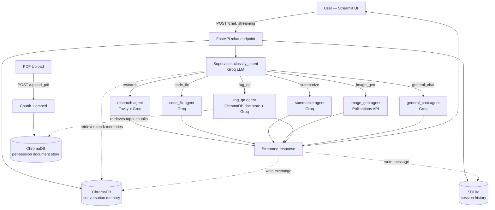

# Agentic Multi-Tool AI Assistant

A multi-agent AI assistant built with **LangGraph**, **FastAPI**, and **Streamlit**.
A supervisor node classifies each incoming message into one of six intents and
routes it to a specialized sub-agent: web research, code debugging,
summarization, image generation, PDF question-answering (RAG), or general
chat. Conversations are remembered across turns using a **ChromaDB**
semantic memory store, and the full transcript is persisted in **SQLite**.

All LLM/tool calls use free-tier services: **Groq** (LLM inference), **Tavily**
(web search), and **Pollinations** (keyless image generation).

---

## Architecture



### LangGraph supervisor graph


See `backend/supervisor.py` for the actual `StateGraph` definition (nodes,
conditional edges, and the classifier prompt).

---

## Project structure

```
agentic-multi-tool-ai-assistant/
├── backend/
│   ├── main.py                # FastAPI app, /chat (streaming), /upload_pdf, /history
│   ├── supervisor.py          # LangGraph StateGraph: classifier + routing
│   ├── llm.py                 # Shared Groq client wrapper (stream + non-stream)
│   ├── config.py              # Env-var driven settings
│   ├── logger.py              # Shared logging setup
│   ├── agents/
│   │   ├── research.py        # Tavily search + Groq synthesis
│   │   ├── code_fix.py        # Language detection + bug fixing
│   │   ├── summarize.py       # Overview / key points / conclusion
│   │   ├── image_gen.py       # Pollinations image URL generation
│   │   ├── rag_qa.py          # PDF chunk indexing + retrieval QA
│   │   └── general_chat.py    # Fallback conversational agent
│   ├── memory/
│   │   ├── chroma_memory.py   # Semantic conversation memory (ChromaDB)
│   │   └── sqlite_store.py    # Session/message transcript (SQLite)
│   ├── models/schemas.py      # Pydantic request/response models
│   └── requirements.txt
├── frontend/
│   ├── app.py                 # Streamlit chat UI, PDF upload, image rendering
│   └── requirements.txt
├── data/                      # SQLite DB + ChromaDB persistence (gitignored)
├── docker-compose.yml
├── backend/Dockerfile
├── frontend/Dockerfile
├── .env.example
└── README.md
```

---

## Setup

### 1. Get free API keys

- **Groq**: https://console.groq.com/keys (free tier)
- **Tavily**: https://tavily.com (free tier, 1000 searches/month)
- **Pollinations**: no key required

### 2. Configure environment

```bash
cp .env.example .env
# then edit .env and paste in your GROQ_API_KEY and TAVILY_API_KEY
```

### 3a. Run with Docker (recommended)

```bash
docker compose up --build
```

- Backend: http://localhost:8000 (docs at `/docs`)
- Frontend: http://localhost:8501

### 3b. Run locally without Docker

```bash
# Backend
python -m venv .venv && source .venv/bin/activate
pip install -r backend/requirements.txt
uvicorn backend.main:app --reload --port 8000

# In a second terminal — frontend
pip install -r frontend/requirements.txt
BACKEND_URL=http://localhost:8000 streamlit run frontend/app.py
```

---

## How routing works

Every message sent to `POST /chat` first passes through
`supervisor.classify_intent`, which asks the Groq LLM to label the message as
exactly one of: `research`, `code_fix`, `summarize`, `image_gen`, `rag_qa`,
`general_chat`. The FastAPI endpoint streams back:

```
data: {"type": "intent", "intent": "research"}
data: {"type": "token", "content": "..."}
data: {"type": "token", "content": "..."}
data: {"type": "done"}
```

You can also force a specific agent by passing `"intent_override": "code_fix"`
in the request body — useful for testing or building custom UI shortcuts.

---

## Example queries per agent

| Agent | Example message |
|---|---|
| `research` | "What are the latest developments in small modular nuclear reactors, and which countries are leading deployment?" |
| `code_fix` | Paste a Python function with an off-by-one loop bug and ask: "This function is supposed to return the last 3 items but it's throwing an IndexError, can you fix it?" |
| `summarize` | Paste a long article/report and ask: "Summarize this for me." |
| `image_gen` | "Generate an image of a lighthouse at sunset in a watercolor painting style." |
| `rag_qa` | Upload a PDF via the sidebar, then ask: "According to the document, what were the Q3 revenue figures?" |
| `general_chat` | "What's a good way to structure a daily journaling habit?" |

---

## Persistent memory

- **ChromaDB (`conversation_memory` collection)** — every user/assistant
  exchange is embedded (using Chroma's built-in `all-MiniLM-L6-v2` embedding
  function, no extra API key needed) and stored with the `session_id` as
  metadata. On each new message, the top-k most semantically relevant past
  exchanges for that session are retrieved and injected into the agent's
  prompt as context.
- **ChromaDB (`rag_<session_id>` collections)** — one collection per session
  holds the chunked+embedded text of any uploaded PDFs, used exclusively by
  the `rag_qa` agent.
- **SQLite (`data/sqlite/chat_history.db`)** — the durable, ordered
  transcript of every message per session, exposed via `GET /history/{session_id}`.

---

## Error handling & logging

- All agent modules and the FastAPI layer use a shared structured logger
  (`backend/logger.py`).
- Missing API keys are detected at startup and logged as warnings (rather
  than crashing), so unaffected agents keep working.
- The `/chat` stream emits an explicit `{"type": "error", "detail": "..."}`
  event on failure instead of silently dropping the connection, and a global
  FastAPI exception handler returns structured JSON for non-streaming routes.
- PDF indexing validates that extractable text was found and returns a
  `422` with a clear message if a PDF appears to be scanned/image-only.

---

## Notes & limitations

- Pollinations, Groq, and Tavily free tiers are rate-limited; heavy use may
  require upgrading to a paid tier.
- The RAG PDF store is scoped per `session_id` and is not automatically
  cleaned up — for production use, add a retention/cleanup job.
- Intent classification is LLM-based (not a fixed rules engine), so edge
  cases can occasionally be misrouted; use `intent_override` to force a
  specific agent if needed.
